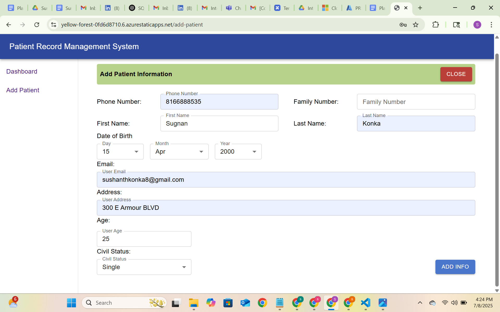

# Hospital Management System - Project

## Overview
This project is a prototype for a Hospital Management System (HMS) using a **microfrontend architecture**. The system consists of multiple React microfrontends, backed by .NET Core Web API services, and deployed on Microsoft Azure.

The main goal is to build a scalable, modular, and maintainable system that can be extended easily with new features.

---

## Architecture

- **shell-app**: React container app (host) responsible for routing and integrating microfrontends using Module Federation.
- **login-mf**: Login microfrontend for user authentication.
- **dashboard-mf**: Dashboard microfrontend displaying user data and navigation.
- **add-patient-mf**: Microfrontend to add and register new patients.
- **Backend Services**: .NET Core Web APIs handling business logic and data persistence.
- **Azure Cloud**: Hosting frontends via Azure Static Web Apps, backend APIs on Azure App Services, and data stored in Azure SQL Database.

## System Architecture


---

## Technologies Used

- **Frontend:** React, React Router, Module Federation, Material UI, JavaScript, CSS (including Flexbox), HTML  
- **Backend:** C#, ASP.NET Core Web API, Entity Framework, Swagger for API documentation  
- **Database:** SQL Server (local), Azure SQL Database (cloud)  
- **Development Tools:** VS Code, GitHub, npm, Postman  
- **Cloud & Deployment:** Azure Static Web Apps, Azure App Services, Azure SQL Server, Azure Resource Groups, Azure Portal  
- **Project Management & Documentation:** Jira, Confluence, Draw.io, Figma  
- **Testing:** Jest (JavaScript testing), xUnit (.NET testing), Playwright (end-to-end testing)  
- **Operating Systems:** Windows (primary development), MacOS (optional/support)  
- **Others:** Material UI (React UI library)

---

## Related Repositories

### Frontend Microfrontends
- [Shell App (Container)](https://github.com/rbpeddapalli/bs-prms-shell-app)
- [Login Microfrontend](https://github.com/rbpeddapalli/bs-prms-login)
- [Dashboard Microfrontend](https://github.com/rbpeddapalli/bs-prms-dashboard)
- [Add Patient Microfrontend](https://github.com/rbpeddapalli/bs-prms-add-patient)

### Backend Services
- [Add Patient Registration API](https://github.com/rbpeddapalli/bs-prms-add-patient-service)
- [Login Service](https://github.com/rbpeddapalli/bs-prms-login-service)
- [Dashboard Service](https://github.com/rbpeddapalli/bs-prms-dashboard-service)

## Testing with Playwright

We integrated [**Playwright**](https://github.com/rbpeddapalli/bs-prms-playwrightintegration) for automated end-to-end testing of critical user flows like login and patient registration.

- Test setup with `npx playwright install`
- Tests are organized under the `/tests` directory
- Run tests using:  
  ```bash
  npx playwright test


---

## Key Milestones Completed

- Developed patient registration form using plain HTML/CSS, then upgraded to React with Material UI.
- Created React microfrontends using Module Federation for login, dashboard, and patient management.
- Built .NET Core Web APIs with Swagger integration for easy API testing and documentation.
- Set up Azure environment with resource groups, Static Web Apps, and App Services.
- Configured CI/CD pipelines using GitHub Actions for automated deployment.
- Integrated Azure SQL Database for persistent storage.
- Designed UI/UX mockups using Figma.
- Learned and practiced C#, ASP.NET Core, SQL Server, and React fundamentals.
- Planned upcoming features: microservices communication with Azure Service Bus, containerization with Docker and Kubernetes.

---

## 📸 Screenshots

<h3>🔐 Login Page</h3>


<h3>📊 Dashboard Page</h3>


<h3>➕ Add Patient Page</h3>


<h3>📈 Dashboard View</h3>


## Future Plans

- Implement microservices communication using Azure Service Bus.
- Explore advanced healthcare domain standards such as HL7 and FHIR.
- Enhance responsiveness and accessibility of the UI.
- Create Blazor frontend alternative.

---

## About Me

I’m a passionate and goal-driven Full Stack Developer with hands-on experience building scalable, modular web applications using React, ASP.NET Core, and Azure cloud services. I specialize in developing microfrontend-based systems that promote independent team collaboration, faster releases, and clean separation of concerns.

My recent project, a Hospital Management System , reflects my ability to design and implement production-ready systems—integrating secure authentication, RESTful APIs, cloud deployment, database architecture, CI/CD pipelines, and end-to-end testing using Playwright.

I'm committed to writing clean, maintainable code using SOLID principles, Clean Architecture, and modern UI/UX practices with tools like Figma and Material UI. I enjoy working across the stack, solving real-world problems, and continuously improving my skills.


---

## 📬 Contact

I'm open to collaboration, feedback, or exciting opportunities. Feel free to reach out!

- 📧 Email: [konkasushanth15@gmail.com]
- 💼 LinkedIn: [https://www.linkedin.com/in/konka453/]
- 📍 Location: [Plano, Texas] 
 

---

*Thank you for visiting!*
